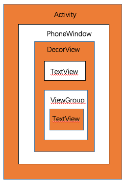

# Android 自定义View的绘制

## 一、Android的UI管理层级关系
   

PhoneWindow是Android系统中最基本的窗口系统，每个Activity会创建一个；  
DecorView本质是一个FrameLayout，是所有View的祖先；  
ViewGroup是View的集合。

## 二、View的绘制流程
   1. 测量 (`onMeasure`)
   
   2. 布局 (`onLayout`)
   
   3. 绘制 (`onDraw`)
   
## 三、onMeasure()三种测量模式
   * UNSPECIFIED:  不指定测量模式，系统内部使用  
   
   * EXACTLY:      精确测量模式，当数值是match_parent或精确数值时生效  
   
   * AT_MOST:      最大值模式，当数值是wrap_content时生效
